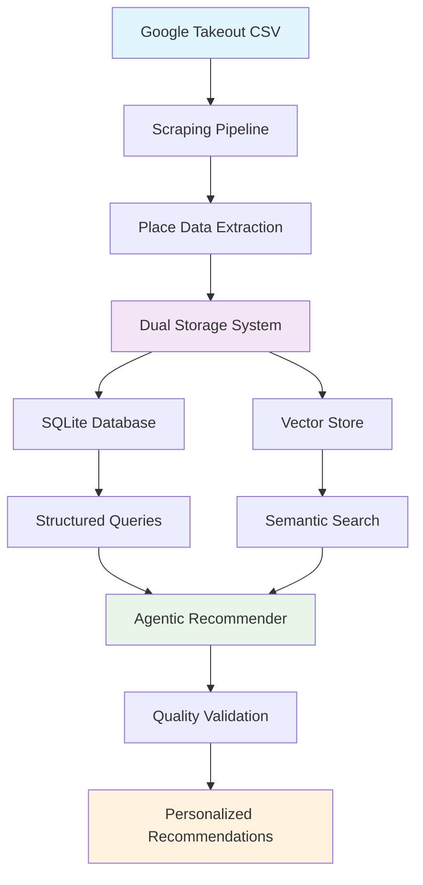

# VibeDining - AI-Powered Restaurant Recommendation Platform

## Overview

VibeDining is a full-stack intelligent restaurant recommendation platform that combines advanced AI agents with modern web technologies. The system processes user-saved restaurant data and provides personalized dining recommendations through natural language conversations.

**Architecture**: Next.js + TypeScript frontend with Python FastAPI backend powered by LangGraph agents and vector search.

## 🏗️ System Architecture

```
┌─────────────────────────────────────────────────────────────────────────┐
│                       VibeDining Full-Stack Platform                    │
├─────────────────────────────────────────────────────────────────────────┤
│                                                                         │
│  ┌─────────────┐    ┌─────────────┐    ┌─────────────┐                 │
│  │  NEXT.JS    │◀──▶│  FASTAPI    │───▶│ LANGGRAPH   │                 │
│  │  FRONTEND   │    │  BACKEND    │    │   AGENTS    │                 │
│  └─────────────┘    └─────────────┘    └─────────────┘                 │
│                                                                         │
│  • React + TS        • REST APIs       • Conversational AI            │
│  • Tailwind CSS     • WebSocket Chat   • Vector Search                │
│  • Chat Interface   • Session Mgmt     • Multi-tool Agents            │
│  • Real-time UI     • FastAPI Docs     • Quality Validation           │
│                                                                         │
└─────────────────────────────────────────────────────────────────────────┘
```

## 📊 Data Flow



---

## 🕷️ Scraping Pipeline

### Purpose
Extract comprehensive restaurant data from Google Takeout saved lists using cost-optimized web scraping combined with minimal API calls.

### Architecture

```
                    ┌─────────────────────────────────────────┐
                    │          ScrapingPipeline               │
                    │                                         │
                    │  • Orchestrates entire flow            │
                    │  • Manages checkpointing                │
                    │  • Controls concurrency (semaphore)    │
                    └─────────────────┬───────────────────────┘
                                      │
                    ┌─────────────────▼───────────────────────┐
                    │         Processing Flow                 │
                    └─────────────────────────────────────────┘

┌─────────────┐    ┌─────────────┐    ┌─────────────┐    ┌─────────────┐
│CSVProcessor │    │ PlaceScraper│    │CheckpointMgr│    │ PlaceStore  │
│             │    │             │    │             │    │             │
│• parse_csv()│───▶│• scrape()   │───▶│• save()     │───▶│• persist()  │
│             │    │• get_id()   │    │• load()     │    │             │
└─────────────┘    │• scrape_data│    │• is_cached()│    └─────────────┘
                   │• api_call() │    └─────────────┘              
                   │• browser    │                                
                   └─────────────┘                               
```

### Key Components

#### 1. **ScrapingPipeline** (Orchestrator)
- **Purpose**: Central coordinator managing the entire scraping process
- **Responsibilities**:
  - Load CSV files and coordinate processing
  - Control concurrency with semaphore limits
  - Handle checkpointing strategy
  - Error handling and retry logic
  - Final data persistence

#### 2. **PlaceScraper** (Core Engine)
- **Purpose**: Extract place data using web scraping + minimal API calls
- **Process**:
  ```python
  async def scrape_place(self, place: CSVPlaceData) -> Place:
      # 1. Get place_id from CID (web scraping)
      place_id = await self._get_place_id(page, place)
      
      # 2. Run in parallel:
      api_task = asyncio.create_task(self._get_api_data(place_id))
      scraping_task = asyncio.create_task(self._scrape_detailed_data(page, place_id))
      
      # 3. Combine results
      api_data, scraped_data = await asyncio.gather(api_task, scraping_task)
      return self._build_place(place, place_id, api_data, scraped_data)
  ```

#### 3. **CheckpointManager** (Persistence)
- **Purpose**: Handle incremental processing and crash recovery
- **Features**:
  - Load existing checkpoint data on startup
  - Save processed places immediately to CSV
  - Staleness detection and re-processing

### Data Models

```python
@dataclass
class CSVPlaceData:
    name: str
    url: str

@dataclass
class Place:
    # Core identifiers
    name: str
    place_id: str
    url: str
    
    # API fields (minimal/free)
    formatted_address: Optional[str]
    coordinates: Optional[tuple[float, float]]
    
    # Scraped rich data
    attributes: List[str]  # Atmospheric attributes
    reviews: List[dict]    # Customer reviews
    rating: Optional[float]
    price_level: Optional[str]
    category: Optional[str]
    
    # Metadata
    last_scraped: str
```

---

## 🗄️ Indexing System

### Purpose
Create a dual-storage system optimized for both structured queries and semantic search.

### Database Schema

```sql
-- Core restaurant data
CREATE TABLE Places (
    id TEXT PRIMARY KEY,
    name TEXT,
    rating REAL,
    price_level TEXT,
    category TEXT,
    formatted_address TEXT,
    description TEXT,
    business_status TEXT,
    -- ... other fields
);

-- Neighborhood/location data
CREATE TABLE Localities (
    id TEXT PRIMARY KEY,
    name TEXT,
    full_name TEXT,
    latitude REAL,
    longitude REAL,
    type TEXT CHECK(type IN ('neighborhood', 'city'))
);

-- Many-to-many relationship
CREATE TABLE PlaceLocalities (
    place_id TEXT REFERENCES Places(id),
    locality_id TEXT REFERENCES Localities(id),
    PRIMARY KEY(place_id, locality_id)
);
```

### Vector Store Structure

**ChromaDB Collections:**
- **Document Types**: `description`, `atmosphere`, `food_drink`, `special_features`
- **Embeddings**: OpenAI `text-embedding-3-small`
- **Reranking**: Cross-encoder model for relevance refinement
- **Metadata**: Place ID, name, document type for cross-referencing

### LLM-Enhanced Data Processing

```python
def _summarize_place_with_llm(self, place: Place):
    # Convert raw scraped data into semantic documents
    response = openai_client.chat.completions.create(
        model="gpt-4o-mini",
        messages=[{
            "role": "user", 
            "content": f"Summarize venue atmosphere and features for: {place.data}"
        }]
    )
    return {
        'atmosphere': "Cozy, intimate setting perfect for dates...",
        'food_drink': "Specializes in craft cocktails and small plates...", 
        'special_features': "Live jazz music on weekends, outdoor seating..."
    }
```

---

## 🤖 Agentic Recommender

### Architecture Overview

The agentic system uses **LangGraph** to create an intelligent recommendation agent that can dynamically choose and combine multiple search strategies.

```
┌─────────────────────────────────────────────────────────┐
│                 AgenticRecommender                       │
├─────────────────────────────────────────────────────────┤
│                                                         │
│  ┌─────────────┐    ┌─────────────┐    ┌─────────────┐ │
│  │ GUARDRAIL   │───▶│ MULTI-TOOL  │───▶│  RESPONSE   │ │
│  │ VALIDATION  │    │   AGENT     │    │ GENERATION  │ │
│  └─────────────┘    └─────────────┘    └─────────────┘ │
│                                                         │
│  • Query Intent     • Vector Search    • Quality Check │
│  • Topic Relevance  • SQL Filtering    • Data Limits  │
│  • Safety Check     • Location Valid   • Honest Reply │
│                                                         │
└─────────────────────────────────────────────────────────┘
```

### Core Components

#### 1. **Guardrail System**
```python
class GuardrailResult(BaseModel):
    allowed: bool = Field(description="Whether query is restaurant-related")
    reason: str = Field(description="Reasoning for decision")

def _guardrail(self, state: State):
    # LLM-based intent classification
    result = self._guardrail_llm.invoke([
        SystemMessage(content="Classify if query is restaurant-related..."),
        HumanMessage(content=state["input"])
    ])
    return {"guardrail_result": result}
```

#### 2. **Multi-Tool Agent**
The agent has access to multiple specialized tools:

```python
class RestaurantSearchTools:
    def vector_search(self, query: str, n_results: int = 20):
        """Semantic similarity search for qualitative features"""
        
    def sql_search(self, constraints: str):
        """SQL queries for specific constraints (location, price, rating)"""
        
    def validate_location_match(self, place_id: str, target_location: str):
        """Verify if results actually match location constraints"""
        
    def get_restaurant_details(self, place_id: str):
        """Get comprehensive details for specific restaurants"""
```

#### 3. **Tool Usage Strategy**

**Vector Search**: Used for qualitative queries
- "cozy atmosphere", "romantic dinner", "good for work"
- Semantic understanding of vibe and ambiance
- Reviews and description analysis

**SQL Search**: Used for specific constraints  
- Neighborhoods: "in East Village", "Williamsburg area"
- Price ranges: "cheap", "$$ level", "under $20"
- Ratings: "highly rated", "4+ stars"
- Cuisine: "Italian", "sushi", "coffee shops"

**Location Validation**: Quality control
- Cross-reference vector results with location constraints
- Filter out results that don't match specified neighborhoods
- Use join table to verify place-locality relationships

### Intelligence & Quality Control

#### Smart Query Processing
```python
# Example system prompt excerpt:
"""
TOOL USAGE STRATEGY:
1. **vector_search**: Use for qualitative queries (atmosphere, vibe)
2. **sql_search**: Use for specific constraints (location, price, cuisine)
3. **validate_location_match**: Verify results match location requirements
4. **get_restaurant_details**: Get full info for promising results

RECOMMENDED APPROACH:
- For queries with LOCATION + VIBE: Use BOTH vector_search AND sql_search
- For queries with specific constraints: Start with sql_search
- ALWAYS cross-reference when location is mentioned
- VALIDATE each result against user constraints
"""
```

#### Quality Validation
```python
# Built-in quality control:
QUALITY_CONTROL = {
    "location_mismatch": "EXCLUDE if doesn't match neighborhood",
    "category_mismatch": "EXCLUDE if wrong type (restaurant vs coffee shop)",
    "insufficient_data": "BE HONEST about limited saved lists",
    "accuracy_over_quantity": "Better to admit data gaps than give bad results"
}
```

#### Honest Data Limitation Handling
```python
# When data is limited:
response_format = """
I found {X} places in your saved lists that match your criteria, but the selection is limited. 

Here's what I found:
[list the few good matches]

Your saved lists don't seem to have many {coffee shops/restaurants} in {location}. 
In the future, I could search the web to find additional options that match your preferences.
"""
```

### State Management

**LangGraph State Extension:**
```python
class State(AgentState):  # Extends LangGraph's AgentState
    # Additional fields for our use case
    input: str
    output: Optional[str] 
    guardrail_result: Optional[GuardrailResult]
    # Inherits: messages (for ReAct agent compatibility)
```

---

## 🔄 Complete System Flow

### 1. **Data Ingestion** (Scraping Pipeline)
```
Google Takeout CSV → Parse Places → Concurrent Scraping → Rich Place Data
```

### 2. **Data Processing** (Indexing System)  
```
Place Data → LLM Summarization → Dual Storage (SQL + Vector) → Searchable Index
```

### 3. **User Query** (Agentic Recommender)
```
User Input → Guardrail → Multi-Tool Search → Quality Validation → Response
```

### Example Query Flow

**User**: *"Find me a cozy coffee shop in Williamsburg where I can work"*

1. **Guardrail**: ✅ Restaurant-related query approved
2. **Agent Analysis**: Location (Williamsburg) + Vibe (cozy, work-friendly) + Category (coffee shop)
3. **Tool Execution**:
   - `sql_search("coffee shops in Williamsburg")` → Find Williamsburg coffee shops
   - `vector_search("cozy coffee shop good for work")` → Find work-friendly atmospheres
   - `validate_location_match(place_ids, "Williamsburg")` → Verify locations
4. **Quality Control**: Filter results that don't match constraints
5. **Response**: Provide 2-3 validated recommendations or honest "limited data" response

---

## 🚀 Key Benefits

### **Cost Optimization**
- Scraping-first approach minimizes API costs
- LLM processing creates rich semantic data from free scraped content
- Efficient vector storage with smart document chunking

### **Intelligent Search**
- Multi-modal approach: structured + semantic + validation
- Agent decides optimal tool combination per query
- Quality-first results with honest limitation acknowledgment

### **Scalable Architecture**
- Modular design allows independent component scaling
- Async processing for high throughput
- Clean separation between scraping, indexing, and recommendation

### **User Experience**
- Natural language queries ("cozy", "romantic", "good for work")
- Location-aware recommendations
- Transparent about data limitations
- Future-ready for web search enrichment

---

## 🛠️ Quick Start

### Prerequisites
- Node.js 18+ and npm
- Python 3.11+
- OpenAI API key

### 1. Clone and Install
```bash
git clone <repository-url>
cd vibedining

# Frontend setup
cd frontend
npm install

# Backend setup  
cd ../backend
pip install -r requirements.txt
```

### 2. Environment Configuration
```bash
# Backend (.env in /backend/)
OPENAI_API_KEY=your_openai_key
GOOGLE_MAPS_API_KEY=your_google_maps_key

# Frontend (.env.local in /frontend/)
NEXT_PUBLIC_API_URL=http://localhost:8000
```

### 3. Run the Application
```bash
# Terminal 1: Start backend
cd backend
python main.py

# Terminal 2: Start frontend  
cd frontend
npm run dev
```

### 4. Access the Platform
- **Frontend**: http://localhost:3000
- **API Docs**: http://localhost:8000/docs
- **Chat Interface**: Natural language restaurant queries

---

## 🔮 Future Enhancements

### **Web Search Integration**
- Automatic web search when saved lists have insufficient data
- Real-time hours, menu updates, recent reviews
- Dynamic data enrichment

### **Advanced Personalization**
- User preference learning
- Historical recommendation feedback
- Collaborative filtering with other users

### **Enhanced Data Sources**
- Multiple platform integration (Yelp, OpenTable, etc.)
- Social media sentiment analysis
- Real-time event and crowd data

---

## 📁 Project Structure

```
vibedining/
├── frontend/                   # Next.js + TypeScript frontend
│   ├── src/
│   │   ├── app/               # Next.js app router
│   │   │   ├── api/           # API route handlers
│   │   │   ├── layout.tsx     # Root layout
│   │   │   └── page.tsx       # Home page
│   │   ├── components/        # React components
│   │   │   ├── ChatInterface.tsx
│   │   │   ├── ChatInput.tsx
│   │   │   ├── MessageList.tsx
│   │   │   └── Header.tsx
│   │   ├── hooks/             # Custom React hooks
│   │   └── lib/               # Utility functions
│   ├── package.json
│   └── README.md              # Frontend-specific docs
│
├── backend/                   # FastAPI + Python backend
│   ├── main.py               # FastAPI server
│   ├── simple_conversational_agent.py  # LangGraph agents
│   ├── indexer.py            # Data indexing system
│   ├── model.py              # Data models
│   ├── places.db             # SQLite database
│   ├── places_vector_db/     # ChromaDB vector store
│   ├── requirements.txt      # Python dependencies
│   └── README.md             # Backend-specific docs
│
├── cli_e2e/                  # End-to-end CLI tools
├── README.md                 # This file (overview)
└── requirements.txt          # Root dependencies
```

---

## 🎯 Design Philosophy

**Data-Driven Intelligence**: Leverage user's actual saved places rather than generic recommendations

**Quality Over Quantity**: Better to provide fewer accurate results than many irrelevant ones

**Transparency**: Be honest about data limitations and system capabilities

**Cost Efficiency**: Maximize value from free/low-cost data sources before expensive API calls

**User Intent Understanding**: Go beyond keyword matching to understand qualitative preferences

**Modular Architecture**: Each component can be improved or replaced independently

This architecture creates a foundation for highly personalized, intelligent restaurant recommendations that understand both explicit constraints and subtle preferences while maintaining cost efficiency and result quality.